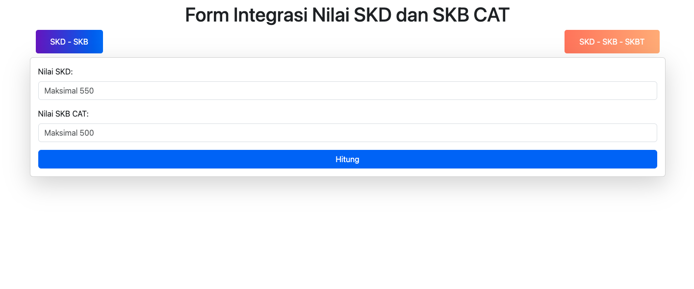

# Hitung Nilai SKD & SKB CPNS 2024

**Hitung Nilai SKD & SKB CPNS** adalah aplikasi sederhana berbasis PHP Native yang memanfaatkan HTML dan Bootstrap. Aplikasi ini dirancang untuk membantu peserta seleksi CPNS menghitung nilai integrasi SKD, SKB, dan SKBT secara akurat, sesuai dengan aturan bobot seleksi CPNS.

---

## ✨ Fitur Utama
- **Hitung SKD & SKB Otomatis**: Perhitungan sesuai bobot 40% untuk SKD dan 60% untuk SKB.
- **Antarmuka Modern & Responsif**: Menggunakan framework Bootstrap untuk tampilan user-friendly.
- **Validasi Input Otomatis**: Membatasi nilai input agar tidak melebihi batas maksimal.
- **Mudah Digunakan**: Aplikasi ringan yang dapat dijalankan di server lokal maupun online tanpa memerlukan framework tambahan.

---

## 🛠️ Teknologi yang Digunakan
- **PHP Native**: Untuk logika perhitungan backend.
- **HTML & CSS**: Untuk struktur dan styling dasar.
- **Bootstrap**: Untuk desain responsif dan modern.

---

## 🚀 Cara Menggunakan
1. **Clone atau Unduh Proyek Ini**  
   Clone repositori ini dengan perintah:
   ```bash
   git clone https://github.com/giriastra/hitung-nilai-skd-skb.git


## 💻 Demo Langsung
Coba aplikasi ini secara langsung di sini:
- ** Khusus SKD & SKB : 👉 https://s.id/hitung-nilai-skd-skb
- ** Khusus SKD & SKB - SKBT : 👉 https://s.id/hitung-nilai-skd-skb-skbt
- 
---

## ❤️ Dukungan dan Donasi
Aplikasi ini gratis untuk digunakan. Jika Anda merasa aplikasi ini bermanfaat, Anda dapat mendukung pengembang untuk pengembangan lebih lanjut melalui donasi berikut:

## 💰 LYNK Ngopi
Setiap donasi sangat berarti. Terima kasih atas dukungannya! 🙏
- ** https://lynk.id/skbpranatakomputer/s/Yazg84M

---

## ⭐ Kontribusi
Jika Kamu ingin berkontribusi pada pengembangan aplikasi ini, jangan ragu untuk membuat pull request atau melaporkan masalah melalui tab Issues. Saya sangat terbuka untuk ide-ide baru!

---

## 📜 Lisensi
Proyek ini dilisensikan di bawah Lisensi MIT. Anda bebas menggunakannya dengan tetap menyertakan atribusi kepada pengembang.

---

## ⭐ Jangan lupa untuk memberikan bintang pada repositori ini jika Anda merasa aplikasi ini membantu! 😊




